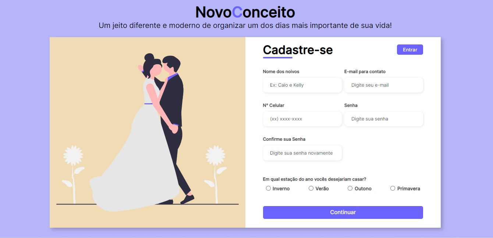

# Cadastro para noivos

> NovoConceito

Projeto criado através de uma vídeo aula da Larissa Kich

[🏷️Clique aqui para acessar](https://eduardooliveira3101.github.io/CADASTRO/)

## 🛠️Tecnologias  utilizadas

- HTML 
- CSS
- Git e Github

## Contato
- c.edu31@hotmail.com
- eduoliveira31200@gmail.com